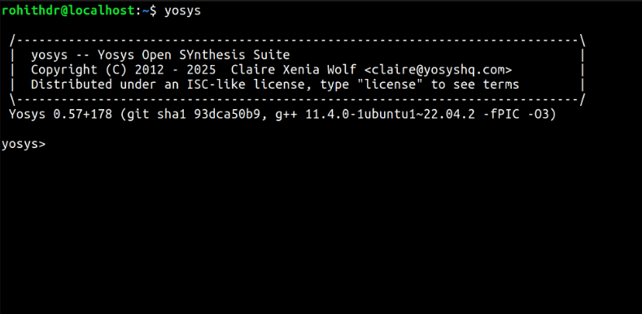

# RISC-V Reference SoC Development Environment
## VSD Tapeout Program Tool Installation Guide

This repository contains comprehensive setup instructions for establishing a complete RISC-V System-on-Chip (SoC) development environment as part of the VSD Tapeout Program.

## Prerequisites

Before beginning the installation process, ensure your system meets the following minimum requirements:

| Component | Requirement |
|-----------|-------------|
| **Memory** | 6 GB RAM minimum |
| **Storage** | 50 GB available disk space |
| **Operating System** | Ubuntu 20.04 LTS or newer |
| **CPU** | 4 virtual CPUs minimum |

## Virtual Environment Setup

If you're running Ubuntu in a virtual machine, you may need to optimize the display settings for better usability:

### Screen Resolution Configuration

```bash
# Update package repositories
sudo apt update

# Install essential build tools and kernel headers
sudo apt install build-essential dkms linux-headers-$(uname -r)

# Navigate to VirtualBox Guest Additions directory
cd /media/spatha/VBox_GAs_7.1.8/

# Execute the auto-configuration script
./autorun.sh
```

## Essential Development Tools

### Yosys Synthesis Suite

Yosys is an open-source RTL synthesis framework that converts Verilog designs into gate-level netlists.

```bash
# Refresh package database
sudo apt-get update

# Clone the official Yosys repository
git clone https://github.com/YosysHQ/yosys.git
cd yosys

# Install make utility if not present
sudo apt install make

# Install comprehensive dependency packages
sudo apt-get install build-essential clang bison flex \
    libreadline-dev gawk tcl-dev libffi-dev git \
    graphviz xdot pkg-config python3 libboost-system-dev \
    libboost-python-dev libboost-filesystem-dev zlib1g-dev

# Configure build system for GCC
make config-gcc

# Initialize required Git submodules (including ABC)
git submodule update --init --recursive

# Compile the synthesis suite
make

# Install system-wide
sudo make install
```



### Icarus Verilog (iverilog)

Icarus Verilog is a comprehensive Verilog simulation and synthesis tool for digital circuit verification.

```bash
# Update package repositories
sudo apt-get update

# Install Icarus Verilog simulator
sudo apt-get install iverilog
```


### GTKWave Waveform Viewer

GTKWave provides advanced waveform visualization capabilities for analyzing simulation results.

```bash
# Refresh package listings
sudo apt-get update

# Install GTKWave waveform analyzer
sudo apt install gtkwave
```


## Installation Verification

After completing the installation process, verify that all tools are properly installed by running:

```bash
# Check Yosys version
yosys -V

# Check Icarus Verilog version
iverilog -V

# Check GTKWave version
gtkwave --version
```

## Next Steps

With your development environment successfully configured, you can now proceed to:

1. Clone your RISC-V SoC design repositories
2. Set up project-specific toolchains
3. Begin RTL development and verification workflows
4. Execute synthesis and implementation flows

## Additional Resources

- [Yosys Documentation](https://yosyshq.net/yosys/)
- [Icarus Verilog Manual](http://iverilog.icarus.com/)
- [GTKWave User Guide](http://gtkwave.sourceforge.net/)
- [VSD Training Programs](https://www.vlsisystemdesign.com/)

## Contributing

Please refer to the project's contribution guidelines before submitting pull requests or reporting issues.

## License

This setup guide is provided as part of the VSD educational program. Please check individual tool licenses for usage terms and conditions.
